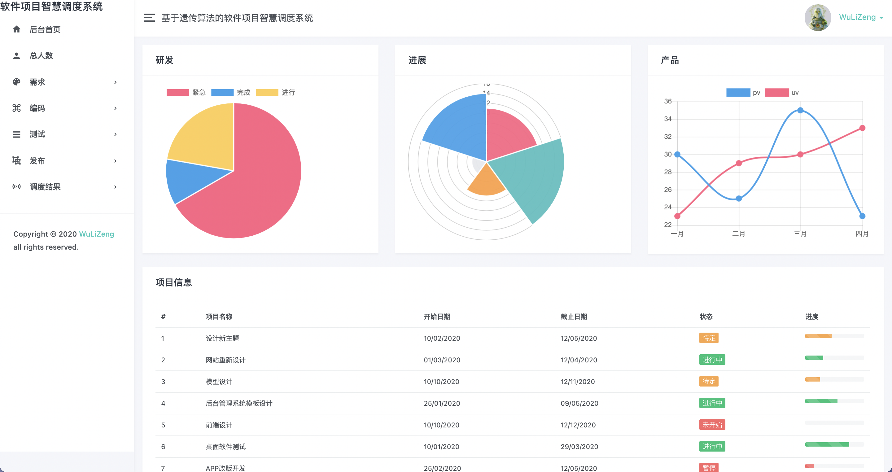

# Mission_FSA

FSA-CMS

### 🏞待定界面

### ✂︎模块

requirement

encoding

examination

projection

----

> 草稿🤥

# 工序

多个项目

人 项目工时可输入 可控（考虑一个实体）

## 1.需求

单个项目名

人 工

时间

（线性时间） 算法已经解决

## 2.编码

每人  工时

## 3.测试

## 4.发布

----

结果 多少时间 做多少活儿

已经有png结果图