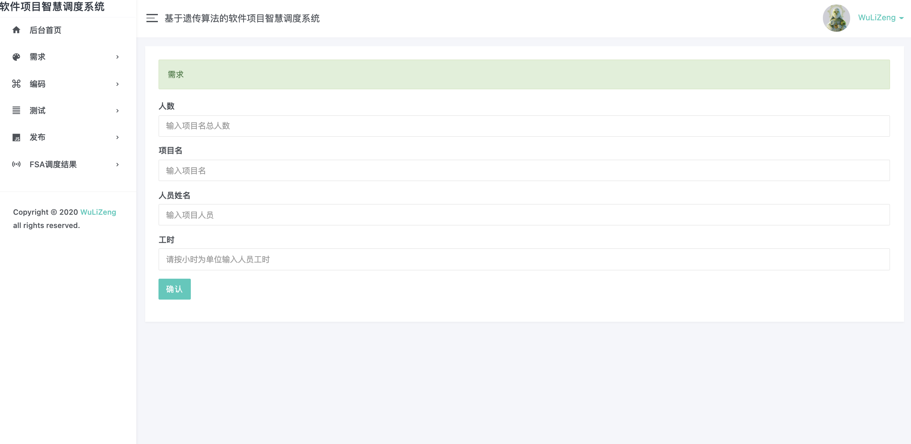

# Mission_FSA

FSA-CMS

### 🏞待定界面

**👀需求   第一道工序**

**💻编码   第二道工序**

**👨‍💻测试   第三道工序**

**🎬发布   第四道工序**

**🧐fsa调度结果**

### ✂︎模块

requirement

encoding

examination

projection

----

> 草稿🤥

# 工序

多个项目

人 项目工时可输入 可控（考虑一个实体）

## 1.需求

单个项目名

人 工

时间

（线性时间） 算法已经解决

## 2.编码

每人  工时

## 3.测试

## 4.发布

----

结果 多少时间 做多少活儿

已经有png结果图

----

----

文字 

姓名编号（必要） 

项目编号（必要）

智慧软件项目及管理系统

## 需求

###      查询需求

增删改查（必要）

1需求

2编码

3设计

4发布

### 显示all

新 标签  显示all

### 设计（必要）

### 维护（可有）

**now必须**

**查询增删改查**

**设计 维护**

**项目总数**

